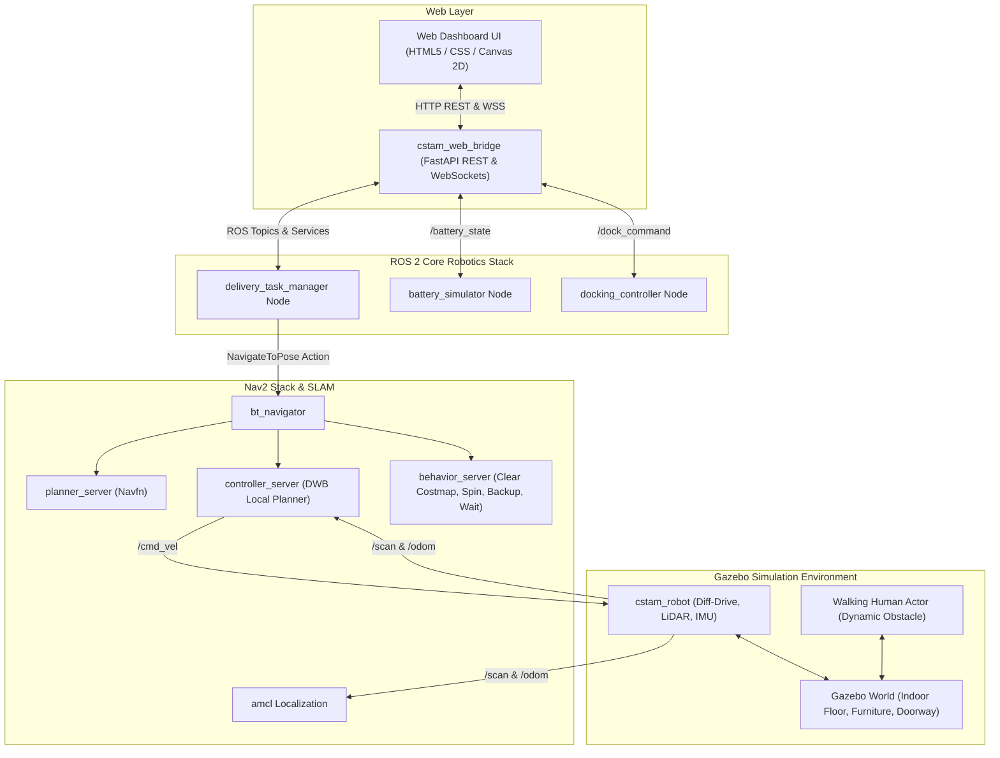
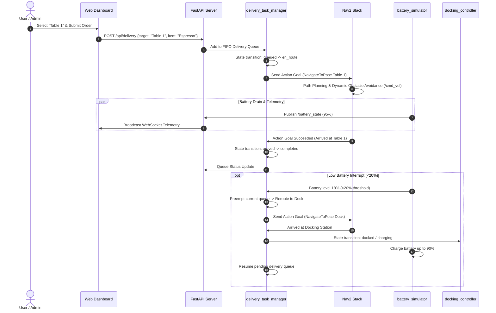

# CSTAM-TUNIBOT Software Architecture & Data Flow Specification

## 1. High-Level System Architecture

The CSTAM Autonomous Indoor Delivery Robot system is divided into three primary layers: **Simulation Layer**, **ROS 2 Core Robotics Layer**, and **Web Control & Telemetry Layer**.

---

## 2. ROS 2 Topic, Service, and Action Matrix

| Component | Interface Name | Interface Type | Message / Action Type | Description |
| :--- | :--- | :--- | :--- | :--- |
| Gazebo / Robot | `/cmd_vel` | Topic (Pub/Sub) | `geometry_msgs/msg/Twist` | Differential wheel velocity commands |
| Gazebo / Robot | `/scan` | Topic (Pub) | `sensor_msgs/msg/LaserScan` | 2D RPLiDAR scan data (360 samples, 12m max range) |
| Gazebo / Robot | `/odom` | Topic (Pub) | `nav_msgs/msg/Odometry` | Wheel odometry state |
| Nav2 Stack | `/navigate_to_pose` | Action | `nav2_msgs/action/NavigateToPose` | Goal pose navigation action interface |
| Battery Sim | `/battery_state` | Topic (Pub) | `sensor_msgs/msg/BatteryState` | Battery percentage, voltage, charging status |
| Task Manager | `/delivery_queue_status`| Topic (Pub) | `std_msgs/msg/String` (JSON) | Live queue state, current task, robot state |
| Task Manager | `/robot_system_state` | Topic (Pub) | `std_msgs/msg/String` | Simple state string (`idle`, `navigating`, `docked`) |
| Docking Ctrl | `/dock_state` | Topic (Pub) | `std_msgs/msg/Bool` | Boolean indicating if robot is physically docked |
| Docking Ctrl | `/dock_command` | Topic (Pub) | `std_msgs/msg/String` | Auto-docking trigger command (`DOCK_NOW`) |

---

## 3. Delivery Execution Sequence Diagram

